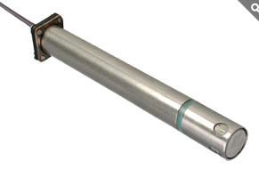
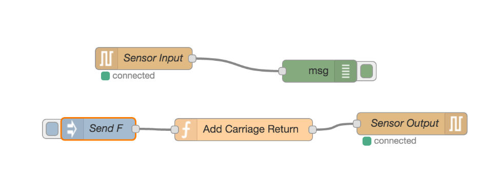

Overview
========

Node-RED is a tool for wiring together hardware devices, APIs and online
services in new and interesting ways. Node-RED provides a browser-based
flow editor that makes it easy to wire together flows using the wide
range nodes in the palette. Flows can be then deployed to the runtime in
a single-click. The light-weight runtime is built on Node.js, taking
full advantage of its event-driven, non-blocking model. This makes it
ideal to run at the edge of the network. The RH-USB relative humidity/
temperature sensor provides a standard USB output that directly feeds
relative humidity and temperature directly into the gateway. The compact
design is ideal for wall or duct mounting. Each unit is factory
calibrated to provide excellent sensitivity, fast response, and
stability. The unit features a simple installation with a direct USB
connection. The design features a 316 SS NEMA 4 (IP66) housing. A
mounting kit is also available that allows for wall or duct mounting.

Required Hardware
=================

-   Intel Internet of Things Gateway

-   Omega RH-USB Sensor

> 

Assumptions
===========

-   Intel Internet of Things Gateway is running the WindRiver
    Intelligent Device Platform (IDP) version 3.0 or above

-   Node.js is installed on the Intel IoT Gateway

-   Node-red node node-red-node-serialport is installed on the Intel IoT
    Gateway

-   Node-Red is installed on the Intel IoT Gateway and is running

Connecting the RS-USB Sensor
============================

Plug the RH-USB sensor in to a USB port on your Intel IoT Gateway. On
the console of the gateway, you should see a message saying what serial
device was created for the USB interface. It is likely /dev/ttyUSB0.
Please make a note of what device was created.

Using Node-Red
==============

The Node-Red browser interface can be reached via
<http://ipaddressofthegateway:1880>. When it first comes up it will look
something like this.


Let’s create a node-red flow to get the badge readings from the RH-USB
reader.

Drag the following nodes from the left bar on to Sheet 1

-   Serial input

-   Serial output

-   function

-   debug

Now, configure the nodes

-   Double click on the serial input node. Click on the pen icon to add
    a new serial port. In the Serial Port field, enter the device you
    noted above when you plugged the RFID reader in to the Intel
    IoT Gateway. Likely /dev/ttyUSB0. Set the Baud Rate to 9600. Leave
    the other fields as default. For example:

> 

-   Click on OK/Update

-   Set the name to “RH-USB In” and click Ok.

-   Double click on the serial output node. Select the serial port you
    created in the steps above. Set the name to “RH-USB Out” and click
    on Ok.

-   Double click on the inject node. Set the Payload to string. Set the
    string to “F” (put the character F in the string field
    without quotes). Set the name to “Send F” and click on Ok.

-   Double click on the function node. Set the name to “Add Carriage
    return” and paste to following text in to the function body:

```javascript
msg.payload = msg.payload+"\r"; 

return msg;
```

-   Click on Ok.

-   Now wire the RH-USB In node to the Debug node by clicking and
    dragging between the small box on the right of the RH-USB In to the
    small box on the left of the Debug node. It should look like this:

> 

-   Now wire the Send F inject node to the Add Carriage return function
    node and the Add Carriage return function node to the RH-USB Out
    serial node. It should look like this:

> 

-   Click on the Deploy button; top right.

-   Ensure the “debug” node is turned on. The box extending to the right
    of the debug should be solid/filled in green.

-   Switch the column on the right from the Info tab to the debug tab.

-   Click on the solid/filled in light blue box on the left side of the
    “Send F” inject node.

    -   You should see the current temperature in Fahrenheit returned in
        the debug tab. It should look like this:

    -   

-   In addition to sending an F to request temperature in Fahrenheit,
    you can also send the following commands. Try experimenting changing
    what you end in the Inject node to request different
    sensor readings.

    -   C Temperature in Deg C.

    -   F Temperature in Deg F.

    -   H Relative Humidity

    -   ENQ Model number and firmware version

    -   PA Relative Humidity and Temperature in Deg F.

        Congratulations! You are successfully communicating via Serial
        to the Omega Relative Humidity USB Probe with
        Temperature Sensor.

Example flow
============

Node-Red supports exporting and importing of flows (into source json).
Here is an export of the above two flows we created. If you import this,
the same nodes and configuration we created manually will automatically
appear on the selected Sheet. Import and Export can be found in the
Node-Red menu by clicking on the 3 horizontal lines to the right of the
Deploy button.

References
==========

-   Omega RH-USB

-   [Omega RH-USB Command
    Reference](ftp://ftp.omega.com/public/DASGroup/products/RH-USB/RH_USB%20Command%20Reference.pdf)

-   Node-red-node-serialport

-   [Node-Red](http://nodered.org/)


