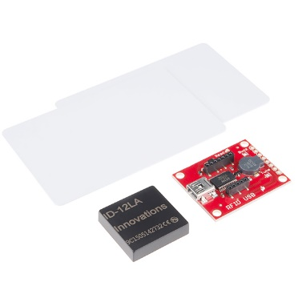
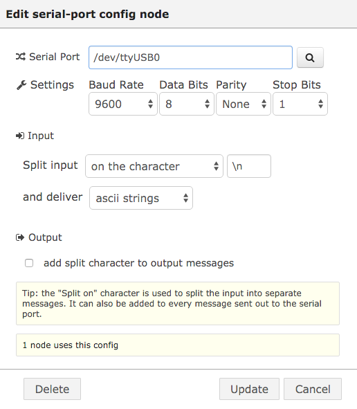

Overview
========

Node-RED is a tool for wiring together hardware devices, APIs and online
services in new and interesting ways. Node-RED provides a browser-based
flow editor that makes it easy to wire together flows using the wide
range nodes in the palette. Flows can be then deployed to the runtime in
a single-click. The light-weight runtime is built on Node.js, taking
full advantage of its event-driven, non-blocking model. This makes it
ideal to run at the edge of the network. The SparkFun RFID Starter Kit,
an all-in-one kit that offer everything you need to create a RFID
project. The kit includes a USB RFID Reader, ID-12LA RFID module, and
two 125kHz RFID cards.

Required Hardware
=================

-   Intel Internet of Things Gateway

-   SparkFun RFID Starter Kit

-   USB Mini-B Cable

> 

Assumptions
===========

-   Intel Internet of Things Gateway is running the WindRiver
    Intelligent Device Platform (IDP) version 3.0 or above

-   Node.js is installed on the Intel IoT Gateway

-   Node-red node node-red-node-serialport is installed on the Intel IoT
    Gateway

-   Node-Red is installed on the Intel IoT Gateway and is running

Connecting the RFID Reader
==========================

Plug the RFID reader in to the board. Plug the small end of the USB
cable in to the board. Plug the other end of the USB cable in to a USB
port on your Intel IoT Gateway. On the console of the gateway, you
should see a message saying what serial device was created for the USB
interface. It is likely /dev/ttyUSB0. Please make a note of what device
was created.

Using Node-Red
==============

The Node-Red browser interface can be reached via
<http://ipaddressofthegateway:1880>. When it first comes up it will look
something like this.

Let’s create a node-red flow to get the badge readings from the RFID
reader.

Drag the following nodes from the left bar on to Sheet 1

-   Serial input

-   debug

Now, configure the nodes

-   Double click on the serial node. Click on the pen icon to add a new
    serial port. In the Serial Port field, enter the device you noted
    above when you plugged the RFID reader in to the Intel IoT Gateway.
    Likely /dev/ttyUSB0. Set the Baud Rate to 9600. Leave the other
    fields as default. For example:

> 

-   Click on OK/Update

-   Set the name to “RFID In”. For example:

> 

-   Click OK

-   Now wire the RFID In node to the Debug node by clicking and dragging
    between the small box on the right of the RFID In node to the small
    box on the left of the Debug node. It should look like this:

> 

-   Click on the Deploy button, top right, and Confirm deploy.

-   Ensure the “debug” node is turned on. The box extending to the right
    of the node should be solid/filled in green.

-   Switch the column on the right from the Info tab to the debug tab.

-   Scan one of your badges.

    -   The badge ID should appear as part of the payload message in the
        debug tab.

-   Scan your other badge.

    -   The badge ID should appear as part of the payload message in the
        debug tab.

        Congratulations! You are successfully communicating via Serial
        to a RFID reader device.

Example flow
============

Node-Red supports exporting and importing of flows (into source json).
Here is an export of the above two flows we created. If you import this,
the same nodes and configuration we created manually will automatically
appear on the selected Sheet. Import and Export can be found in the
Node-Red menu by clicking on the 3 horizontal lines to the right of the
Deploy button.

References
==========

-   SparkFun RFID Starter Kit

-   Node-red-node-serialport

-   [Node-Red](http://nodered.org/)

